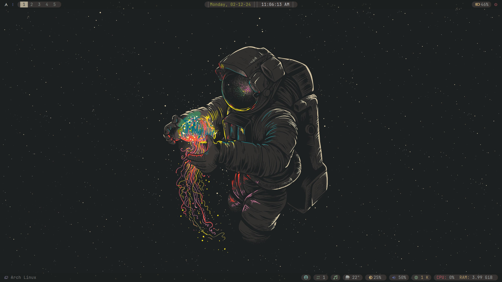
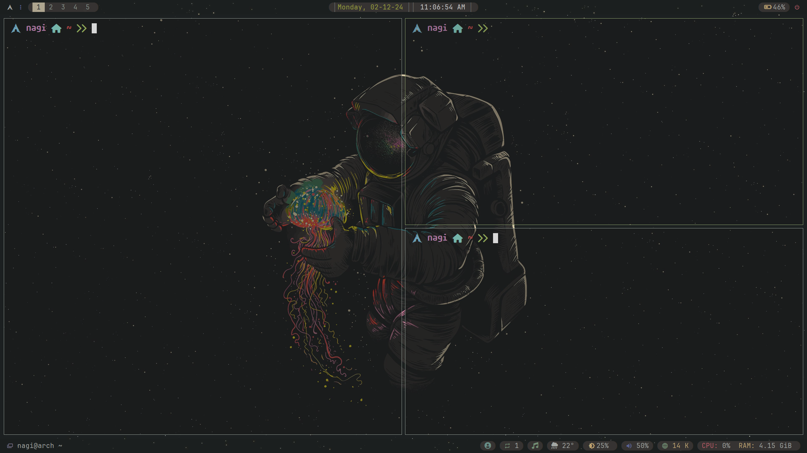

# Dotfiles

This repository contains my personal configurations for Awesome WM, Polybar, Alacritty, and Picom.

## Screenshots

*Desktop with Awesome WM, Polybar, Alacritty, and Picom*

*Another view of my customized desktop setup*

## Contributing

Feel free to fork this repository and make your own customizations. If you have improvements or suggestions, open an issue or submit a pull request.

## License

This project is licensed under the MIT License. See the [LICENSE](LICENSE) file for details.

---

Enjoy my setup and happy customizing!